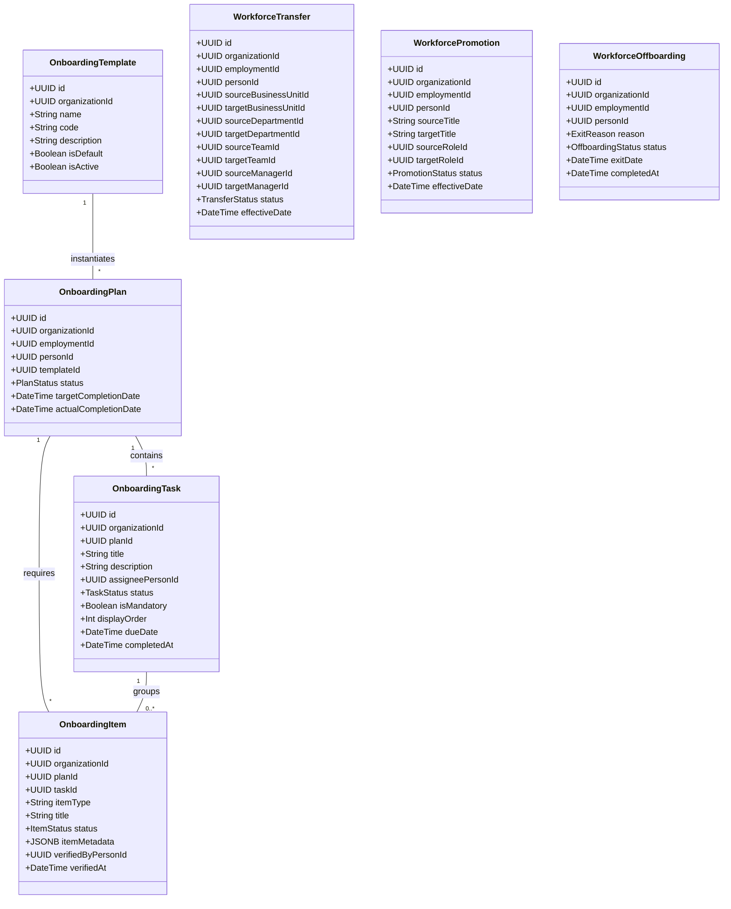

# Domain Model & Architecture — M14 Workforce Onboarding & Lifecycle Engine

## 1. Overview & Business Purpose

The **Workforce Onboarding & Lifecycle Engine (M14)** governs the post-hiring operational lifecycle of personnel within an organization. It manages onboarding plan execution for newly hired employees, orchestrates ongoing workforce movements (Transfers and Promotions), and conducts structured offboarding processes upon employee exit.

M14 connects M13 Recruitment outputs (`Candidate` $\rightarrow$ `Person` + `Employment`) to active organizational contribution:

$$\text{Hire (M13)} \longrightarrow \text{Person + Employment (M2)} \longrightarrow \text{Onboarding Plan (M14)} \longrightarrow \text{Placement (M3)} \longrightarrow \text{Movements} \longrightarrow \text{Offboarding}$$

---

## 2. Core Entities & Value Objects



---

## 3. Lifecycle State Machines & Business Rules

### 3.1 Onboarding Plan State Machine
- `draft`: Created but not yet initiated.
- `initiated`: Assigned to employment, tasks populated.
- `in_progress`: Task completion underway.
- `completed`: All mandatory tasks and verified items completed.
- `cancelled`: Plan aborted.

```text
[draft] ──> [initiated] ──> [in_progress] ──> [completed]
   │             │               │
   └─────────────┴───────────────┴──> [cancelled]
```

### 3.2 Onboarding Task State Machine
- `pending` $\rightarrow$ `in_progress` $\rightarrow$ `completed` / `skipped` / `failed`.

### 3.3 Onboarding Requirement / Item State Machine
- `pending` $\rightarrow$ `submitted` $\rightarrow$ `verified` / `waived`.

### 3.4 Workforce Movement State Machine (Transfer / Promotion)
- `requested` $\rightarrow$ `under_review` $\rightarrow$ `approved` $\rightarrow$ `executed` / `rejected` / `cancelled`.

### 3.5 Workforce Offboarding State Machine
- `initiated` $\rightarrow$ `clearance_in_progress` $\rightarrow$ `cleared` $\rightarrow$ `completed` / `cancelled`.

---

## 4. Assignment & Placement Architecture (M3 Integration)

M14 does **NOT** maintain duplicate assignment tables (`employee_projects`, `onboarding_members`).
- **Mentor Assignment**: Created as an M3 `Assignment` record (`target_type = 'person'`, `role_context = 'mentor'`).
- **Organizational Placement**: Created as an M3 `Assignment` record (`target_type = 'business_unit'` or `'team'`).
- **Project Setup**: Assigned via M3 `Assignments` (`target_type = 'project'`).

M14 orchestrates these setup calls during the `in_progress` onboarding phase.

---

## 5. Employment & Identity Boundaries (M2 Integration)

M14 strictly references:
- M2 `people` table via `person_id`.
- M2 `employments` table via `employment_id`.

M14 does **NOT** alter M2 employment status until an authorized lifecycle workflow (`WorkforceTransfer`, `WorkforcePromotion`, `WorkforceOffboarding`) reaches the `executed` or `completed` state.

Upon offboarding execution:
- M14 sets M2 `employments.status` to `resigned` or `terminated`.
- M14 sets M2 `employments.end_date` to `exit_date`.
- M14 closes active M3 `assignments` associated with the `person_id`.

---

## 6. Cross-Engine Integration Matrix

```text
M13 Recruitment  ──(hired candidate)──>  M2 People (Person + Employment)
                                             │
                                             ▼
                                  M14 Workforce Engine
                                  ├── Onboarding Plans & Tasks
                                  ├── M3 Assignment Setup (Mentors & Placements)
                                  ├── M6 Check-in Meetings (meeting_id)
                                  ├── M7 Learning Programs (learning_program_id)
                                  ├── M8 Probation Reviews (evaluation_id)
                                  ├── Transfers & Promotions (M2 Employment update)
                                  └── Offboarding Clearances
                                             │
                                             ▼
                                  M10 Audit & Outbox Engine
                                             │
                                             ▼
                                  M11 Analytics Engine
```

---

## 7. Security, Tenant Scoping & Contextual Authorization

M14 capabilities are enforced via `requireCapability(capability)` in `src/permissions/permissions.middleware.ts`:

- `workforce:view`: View onboarding plans, tasks, templates, transfers, offboardings.
- `workforce:create`: Submit transfer/promotion requests, create onboarding plans.
- `workforce:manage`: Update onboarding task progress, verify items, initiate offboarding.
- `workforce:admin`: Manage onboarding templates (`POST/PATCH /templates`).
- `workforce:approve`: Approve transfers, promotions, and finalize offboardings.

Tenant scoping is enforced on all tables with `organization_id`. Cross-tenant queries return `404 Not Found`.

---

## 8. Canonical Domain Events

1. `workforce.onboarding_plan.created`
2. `workforce.onboarding_plan.initiated`
3. `workforce.onboarding_plan.completed`
4. `workforce.onboarding_plan.cancelled`
5. `workforce.onboarding_task.updated`
6. `workforce.onboarding_task.completed`
7. `workforce.onboarding_item.submitted`
8. `workforce.onboarding_item.verified`
9. `workforce.transfer.requested`
10. `workforce.transfer.approved`
11. `workforce.transfer.completed`
12. `workforce.promotion.requested`
13. `workforce.promotion.approved`
14. `workforce.promotion.completed`
15. `workforce.offboarding.initiated`
16. `workforce.offboarding.clearance_updated`
17. `workforce.offboarding.completed`
18. `workforce.offboarding.cancelled`
