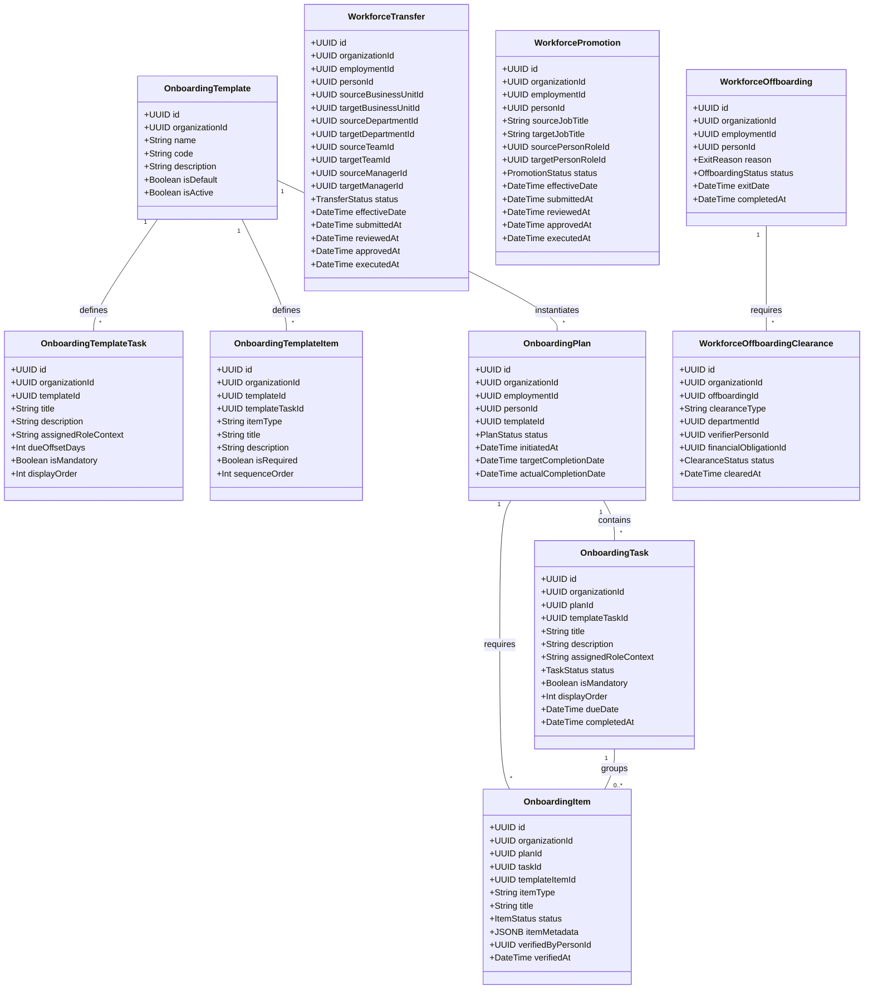

# Domain Model & Architecture — M14 Workforce Onboarding & Lifecycle Engine

## 1. Overview & Business Purpose

The **Workforce Onboarding & Lifecycle Engine (M14)** governs the post-hiring operational lifecycle of personnel within an organization. It manages onboarding plan execution for newly hired employees, orchestrates ongoing workforce movements (Transfers and Promotions), and conducts structured offboarding processes upon employee exit.

M14 connects M13 Recruitment outputs (`Candidate` $\rightarrow$ `Person` + `Employment`) to active organizational contribution:

$$\text{Hire (M13)} \longrightarrow \text{Person + Employment (M2)} \longrightarrow \text{Onboarding Plan (M14)} \longrightarrow \text{Placement (M3)} \longrightarrow \text{Movements} \longrightarrow \text{Offboarding}$$

---

## 2. Core Entities & Value Objects



---

## 3. Lifecycle State Machines & Business Rules

### 3.1 Onboarding Plan State Machine
- `draft`: Created manually or prepared automatically.
- `initiated`: Assigned to employment, tasks and requirement items populated from template.
- `in_progress`: Task completion and requirement submission underway.
- `completed`: All mandatory tasks completed and required items verified.
- `cancelled`: Plan aborted.

```text
[draft] ──(initiate)──> [initiated] ──(start work)──> [in_progress] ──(all mandatory tasks done)──> [completed]
   │                         │                              │
   └──────(cancel)───────────┴──────(cancel)────────────────┴──────(cancel)──────────────────────────> [cancelled]
```

### 3.2 Onboarding Task State Machine
- `pending` $\rightarrow$ `in_progress` $\rightarrow$ `completed` / `skipped` / `failed`.

### 3.3 Onboarding Requirement / Item State Machine
- `pending` $\rightarrow$ `submitted` $\rightarrow$ `verified` / `rejected` / `skipped`.

### 3.4 Workforce Movement State Machine (Transfer / Promotion)
- `draft` $\rightarrow$ `submitted` $\rightarrow$ `pending_review` $\rightarrow$ `pending_approval` $\rightarrow$ `approved` $\rightarrow$ `executed` (or `rejected` / `cancelled`).

```text
[draft] ──(submit)──> [submitted] ──(review)──> [pending_review] ──(request approval)──> [pending_approval] ──(approve)──> [approved] ──(execute date)──> [executed]
   │                      │                          │                                     │                         │
   └──(cancel)────────────┴──(cancel)────────────────┴──(reject)───────────────────────────┴──(reject)──────────────────┴──(cancel)──> [rejected / cancelled]
```

### 3.5 Workforce Offboarding State Machine
- `initiated` $\rightarrow$ `clearance_in_progress` $\rightarrow$ `cleared` $\rightarrow$ `completed` (or `cancelled`).

---

## 4. Assignment & Placement Architecture (M3 Integration)

M14 does **NOT** maintain duplicate assignment tables (`employee_projects`, `employee_teams`, `onboarding_assignees`).
- **Onboarding Task Assignee**: Assigned using M3 `Assignments` with `target_type = 'task'`, `target_id = task.id`, and `assignment_type = 'task_assignment'`.
- **Mentor Assignment**: Created using M3 `Assignments` with `target_type = 'team'`, `'department'`, `'student'`, or `'task'` and `assignment_type = 'mentor'` (or `role_context = 'onboarding_buddy'`).
- **Organizational Placement**: Created as M3 `Assignments` (`target_type = 'business_unit'`, `'department'`, or `'team'`).
- **Project Setup**: Assigned via M3 `Assignments` (`target_type = 'project'`).

M14 orchestrates these setup calls during the `in_progress` onboarding phase.

---

## 5. Promotion Authority Boundaries & Employment Coordination (M2 Integration)

M14 strictly references:
- M2 `people` table via `person_id`.
- M2 `employments` table via `employment_id`.

A Promotion workflow explicitly separates authority concerns:
1. **Job Position & Title**: Mutates M2 `employments.job_title` upon execution.
2. **System / Organizational Role**: Mutates M2 `person_roles` / M12 `roles` upon execution.
3. **Operational Responsibilities**: Creates or updates M3 `assignments` upon execution.

M14 does **NOT** alter M2 employment status until an authorized lifecycle workflow reaches the `executed` or `completed` state.

Upon offboarding execution:
- M14 invokes M2 `EmploymentService.transitionStatus()` to transition employment status to `resigned` or `terminated` based on `exit_reason`.
- M14 sets M2 `employments.end_date` to `exit_date`.
- M14 closes active M3 `assignments` associated with the `person_id`.

---

## 6. M9 Finance Integration Boundary

- Offboarding clearance items (`workforce_offboarding_clearances`) for financial settlement optionally link to M9 `finance_obligations` via `financial_obligation_id`.
- Service-level validation strictly verifies that `financial_obligations.organization_id = workforce_offboarding_clearances.organization_id`.
- Clearance sign-off checks for zero outstanding balance before marking the financial clearance item `cleared`.
- M14 contains **zero payroll** or account balance management logic.

---

## 7. Security, Tenant Scoping & Contextual Authorization

M14 capabilities are enforced via `requireCapability(capability)` in `src/permissions/permissions.middleware.ts`:

- `workforce:view`: View onboarding plans, tasks, templates, transfers, promotions, offboardings.
- `workforce:create`: Submit transfer/promotion requests, create onboarding plans.
- `workforce:manage`: Update onboarding task progress, verify items, initiate offboarding, process clearances.
- `workforce:admin`: Manage onboarding templates and template items (`POST/PATCH /templates`).
- `workforce:approve`: Approve transfers, promotions, and finalize offboardings.

Tenant scoping is enforced on all tables with `organization_id`. Cross-tenant queries return `404 Not Found`.

---

## 8. Canonical Domain Events

1. `workforce.onboarding_plan.created`
2. `workforce.onboarding_plan.initiated`
3. `workforce.onboarding_plan.completed`
4. `workforce.onboarding_plan.cancelled`
5. `workforce.onboarding_task.updated`
6. `workforce.onboarding_task.completed`
7. `workforce.onboarding_item.submitted`
8. `workforce.onboarding_item.verified`
9. `workforce.transfer.requested`
10. `workforce.transfer.submitted`
11. `workforce.transfer.reviewed`
12. `workforce.transfer.approved`
13. `workforce.transfer.completed`
14. `workforce.promotion.requested`
15. `workforce.promotion.submitted`
16. `workforce.promotion.reviewed`
17. `workforce.promotion.approved`
18. `workforce.promotion.completed`
19. `workforce.offboarding.initiated`
20. `workforce.offboarding.clearance_updated`
21. `workforce.offboarding.completed`
22. `workforce.offboarding.cancelled`

