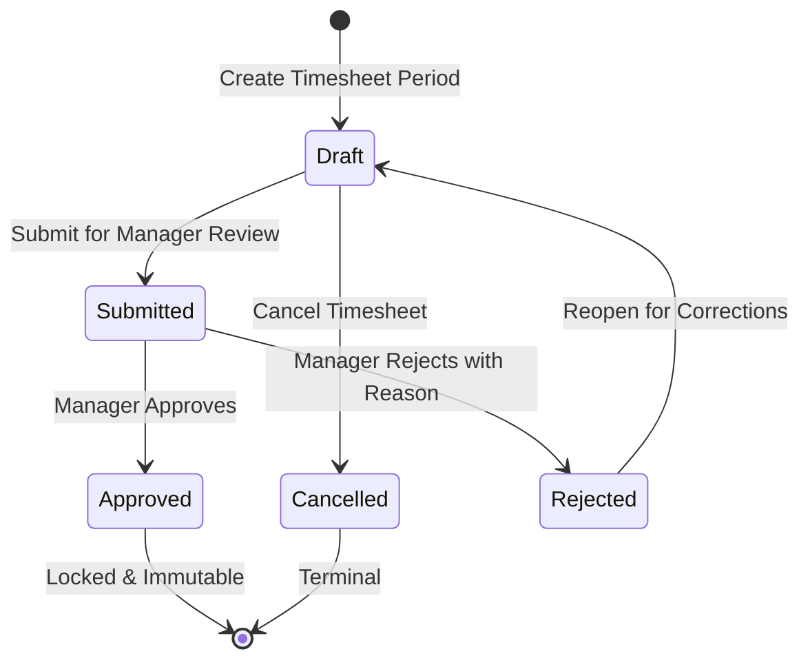
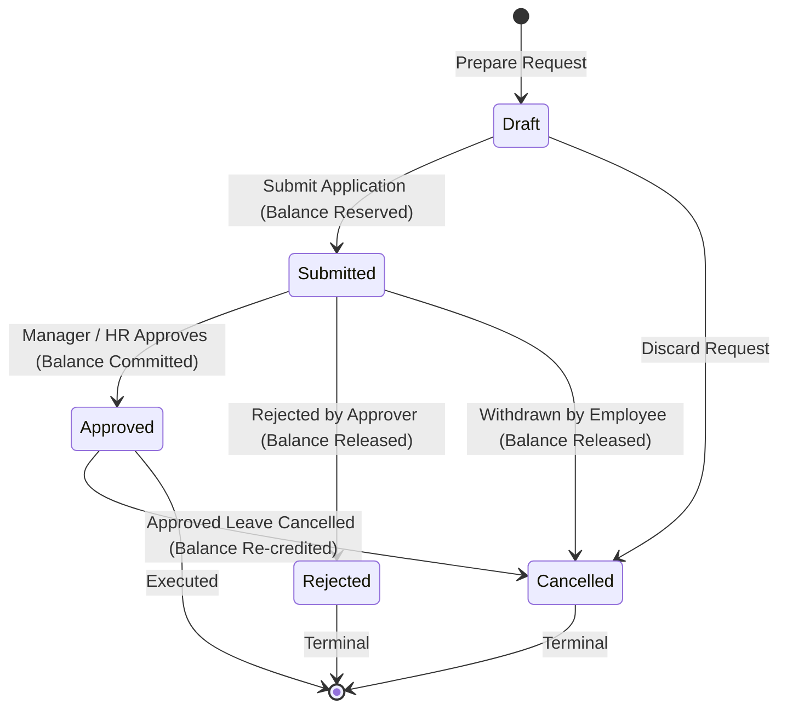
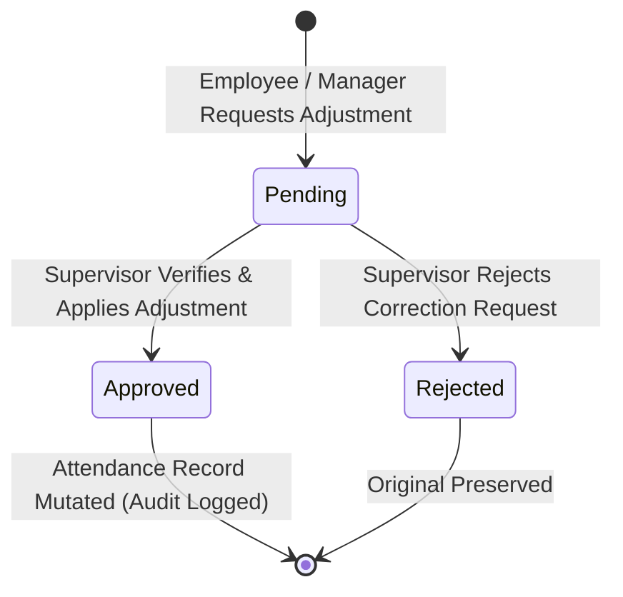

# Domain Model & Architecture — M15 Attendance, Leave & Workforce Time Engine

## 1. Overview & Business Purpose

The **Attendance, Leave & Workforce Time Engine (M15)** governs operational workforce time, physical/virtual presence, leave entitlements, work schedules, and periodic timesheets within DeVoc OS.

M15 provides the critical operational bridge answering:
* *When is a worker expected to be working?* (Work Schedules & Calendar)
* *When is a worker physically or remotely present?* (Attendance Records & Sessions)
* *How much operational time did a worker dedicate?* (Workforce Time Records & Timesheets)
* *When is a worker unavailable due to authorized absence or holiday?* (Leave Engine & Holidays)
* *What is the net forward-looking availability of the workforce?* (Workforce Availability Projection)

M15 operates alongside the core DeVoc OS workforce backbone:

$$\text{Person (M2)} \longrightarrow \text{Employment (M2)} \longrightarrow \text{Work Schedule (M15)} \longrightarrow \text{Attendance (M15)} \longrightarrow \text{Workforce Time (M15)} \longrightarrow \text{Timesheet (M15)}$$

Leave operates as a dedicated availability constraint:

$$\text{Person (M2)} \longrightarrow \text{Leave Request (M15)} \longrightarrow \text{Approved Leave (M15)} \longrightarrow \text{Workforce Availability}$$

Actual work contributions remain strictly separate in M5 Work Engine:

$$\text{Person (M2)} \longrightarrow \text{Assignment (M3)} \longrightarrow \text{Project / Task (M4)} \longrightarrow \text{Work & Outcomes (M5)}$$

---

## 2. Core Entities & Value Objects

```mermaid
classDiagram
    class WorkforceSchedule {
        +UUID id
        +UUID organizationId
        +UUID branchId
        +String name
        +String code
        +ScheduleType scheduleType
        +String timezone
        +Decimal expectedWeeklyHours
        +Boolean isDefault
        +Boolean isActive
    }

    class WorkforceScheduleDay {
        +UUID id
        +UUID organizationId
        +UUID scheduleId
        +Int dayOfWeek
        +Time startTime
        +Time endTime
        +Int breakDurationMinutes
        +Decimal expectedHours
        +Boolean isWorkingDay
    }

    class WorkforceScheduleAssignment {
        +UUID id
        +UUID organizationId
        +UUID employmentId
        +UUID personId
        +UUID scheduleId
        +Date effectiveFrom
        +Date effectiveTo
        +AssignmentStatus status
    }

    class AttendanceRecord {
        +UUID id
        +UUID organizationId
        +UUID employmentId
        +UUID personId
        +Date attendanceDate
        +AttendanceStatus status
        +Int totalPresenceMinutes
        +Int totalBreakMinutes
        +Int totalWorkMinutes
        +Boolean hasMissingCheckout
        +Boolean hasCorrection
        +String notes
    }

    class AttendanceSession {
        +UUID id
        +UUID organizationId
        +UUID attendanceRecordId
        +DateTime checkInAt
        +DateTime checkOutAt
        +Int durationMinutes
        +String checkInIp
        +String checkOutIp
        +String deviceMetadata
    }

    class AttendanceCorrection {
        +UUID id
        +UUID organizationId
        +UUID attendanceRecordId
        +UUID attendanceSessionId
        +DateTime originalCheckInAt
        +DateTime originalCheckOutAt
        +DateTime correctedCheckInAt
        +DateTime correctedCheckOutAt
        +CorrectionStatus status
        +String reason
        +UUID requestedByUserId
        +UUID reviewedByPersonId
        +DateTime reviewedAt
    }

    class WorkforceTimeRecord {
        +UUID id
        +UUID organizationId
        +UUID employmentId
        +UUID personId
        +UUID attendanceRecordId
        +UUID attendanceSessionId
        +TimeType timeType
        +DateTime startedAt
        +DateTime endedAt
        +Int durationMinutes
        +Boolean isOvertime
        +OvertimeStatus overtimeStatus
        +String description
    }

    class WorkforceTimesheet {
        +UUID id
        +UUID organizationId
        +UUID employmentId
        +UUID personId
        +Date periodStartDate
        +Date periodEndDate
        +TimesheetStatus status
        +Decimal totalRegularHours
        +Decimal totalBreakHours
        +Decimal totalOvertimeHours
        +Decimal totalBillableHours
        +DateTime submittedAt
        +UUID approvedByPersonId
        +DateTime approvedAt
        +String rejectionReason
    }

    class WorkforceTimesheetEntry {
        +UUID id
        +UUID organizationId
        +UUID timesheetId
        +UUID timeRecordId
        +Date entryDate
        +TimeType timeType
        +Int durationMinutes
        +Decimal hours
        +String notes
    }

    class LeaveType {
        +UUID id
        +UUID organizationId
        +String name
        +String code
        +Boolean isPaid
        +Boolean requiresApproval
        +Boolean requiresDocumentation
        +Boolean allowNegativeBalance
        +Boolean isActive
    }

    class LeavePolicy {
        +UUID id
        +UUID organizationId
        +UUID leaveTypeId
        +String name
        +String employmentType
        +AccrualFrequency accrualFrequency
        +Decimal annualAllowanceDays
        +Decimal maxCarryForwardDays
        +Int minServiceDaysRequired
    }

    class LeaveBalance {
        +UUID id
        +UUID organizationId
        +UUID employmentId
        +UUID personId
        +UUID leaveTypeId
        +Int year
        +Decimal openingBalance
        +Decimal accruedBalance
        +Decimal adjustedBalance
        +Decimal usedBalance
        +Decimal reservedBalance
        +Decimal availableBalance
    }

    class LeaveRequest {
        +UUID id
        +UUID organizationId
        +UUID employmentId
        +UUID personId
        +UUID leaveTypeId
        +Date startDate
        +Date endDate
        +Decimal totalDays
        +LeaveRequestStatus status
        +String reason
        +UUID approvedByPersonId
        +DateTime approvedAt
        +String rejectionReason
    }

    class LeaveRequestHistory {
        +UUID id
        +UUID organizationId
        +UUID leaveRequestId
        +LeaveRequestStatus fromStatus
        +LeaveRequestStatus toStatus
        +UUID actorPersonId
        +String notes
        +DateTime createdAt
    }

    class WorkforceHoliday {
        +UUID id
        +UUID organizationId
        +UUID branchId
        +Date holidayDate
        +String name
        +HolidayType holidayType
        +Boolean isHalfDay
        +Boolean isOptional
    }

    WorkforceSchedule "1" -- "*" WorkforceScheduleDay : contains
    WorkforceSchedule "1" -- "*" WorkforceScheduleAssignment : assigned via
    AttendanceRecord "1" -- "*" AttendanceSession : consists of
    AttendanceRecord "1" -- "*" AttendanceCorrection : rectified by
    AttendanceRecord "1" -- "*" WorkforceTimeRecord : links to
    WorkforceTimesheet "1" -- "*" WorkforceTimesheetEntry : aggregates
    WorkforceTimeRecord "1" -- "0..1" WorkforceTimesheetEntry : billed in
    LeaveType "1" -- "*" LeavePolicy : governed by
    LeaveType "1" -- "*" LeaveBalance : tracked in
    LeaveType "1" -- "*" LeaveRequest : requested under
    LeaveRequest "1" -- "*" LeaveRequestHistory : audited by
```



---

## 3. Domain Boundaries & Separation of Concerns

### 3.1 M15 Domain Inclusions (What M15 Owns)
* **Work Schedules**: Fixed-hour schedules (e.g. standard office 09:00–17:00), shift definitions, flexible-hour contracts (e.g. 40 hours/week with flexible daily windows), and schedule working day patterns.
* **Schedule Assignments**: Time-delimited associations between M2 Employments and Schedules (`workforce_schedule_assignments`) with non-overlapping temporal constraints.
* **Attendance & Presence**: Recording physical and remote presence, multiple check-in/check-out sessions in a day, missing check-out tracking, and append-only attendance corrections.
* **Workforce Time Records**: Granular UTC timestamped sessions of duration with canonical categorizations (`regular`, `break`, `overtime`, `other`).
* **Timesheets**: Periodic aggregations (weekly, bi-weekly, monthly) capturing workforce time totals, submission workflows, manager sign-offs, and immutable post-approval records.
* **Leave Management**: Configurable leave classifications (`leave_types`), entitlement policies (`leave_policies`), balance accounting (`leave_balances`), leave requests (`leave_requests`), and audit trails (`leave_request_history`).
* **Holidays**: Organization-wide and branch-specific non-working holiday calendars.
* **Workforce Availability Projection**: Pure read-only computational model projecting forward-looking net available capacity for M3 Assignment Engine and M11 Analytics.

### 3.2 Domain Exclusions (What M15 Does NOT Own)
* **Person Identity & Profiles**: Owned by M2 People Engine. M15 holds zero profile, identity, credential, or contact data.
* **Employment Lifecycles**: Owned by M2 People Engine and orchestrated by M14. M15 does not hire, promote, transfer, or terminate employments.
* **Task Responsibility & Staffing**: Owned by M3 Assignment Engine. M15 availability projections never mutate assignments or project teams.
* **Work Delivery & Output Logging**: Owned by M5 Work Engine. M15 time tracking captures elapsed workforce presence; M5 captures qualitative deliverable outcomes and evidence.
* **Payroll & Compensation**: Strictly excluded. M15 computes hours; it never computes wages, overtime multipliers, salary slips, taxes, or payments.
* **Biometric Hardware & Surveillance**: M15 is API-first and hardware-agnostic; it does not interface with biometric drivers, facial recognition, or continuous GPS surveillance.
* **Analytics Dashboards & Caching**: Owned by M11 Analytics. M15 acts solely as an operational transactional source.

---

## 4. Architectural Decisions & Core Business Rules

### 4.1 Work Schedules: Fixed vs Flexible
M15 supports two distinct schedule models:
1. **Fixed Schedule (`schedule_type = 'fixed'`)**:
   * Days of the week are explicitly marked as working or non-working (`is_working_day`).
   * Explicit start and end times are defined per working day (e.g., Monday 09:00 to 17:00).
   * Break allowance is configured (e.g., 60 minutes mandatory break window).
   * Daily expected hours are deterministic ($\text{endTime} - \text{startTime} - \text{breakDuration}$).
2. **Flexible Schedule (`schedule_type = 'flexible'`)**:
   * Working days indicate active operational windows.
   * Daily start/end times may be null or represent optional core presence hours.
   * Target is governed by `expected_weekly_hours` (e.g., 40.0 hours/week).
   * Daily attendance validates presence against weekly minimum thresholds rather than rigid start-time punctuality.

### 4.2 Schedule Assignment & Collision Invariants
* Schedules are assigned to M2 `Employment` records via `workforce_schedule_assignments`.
* **Collision Invariant**: An employment cannot have more than one active schedule assignment for any overlapping `[effective_from, effective_to]` date window within the same organization.
* In-progress assignments may have `effective_to = NULL` (open-ended). When assigning a new schedule, the previous open assignment must be closed with an explicit `effective_to` timestamp prior to or equal to the new assignment's `effective_from`.

### 4.3 Multi-Session Attendance & Interaction Matrix
Attendance represents physical or virtual presence on a given calendar day for an employment:
* **Multi-Session Tracking**: A single `attendance_records` row represents the day. Multiple `attendance_sessions` capture check-in and check-out intervals throughout that day.
* **Punctuality & Punctual Derivations**:
  * Punctuality, early departure, and late arrival are derived against the assigned `workforce_schedule_days` rules.
* **Missing Check-Out**: If a check-in does not receive a matching check-out before the organization's daily threshold (e.g. 04:00 AM next day), `has_missing_checkout` is flagged as `true`, and duration is not finalized until resolved via correction.
* **Interaction Matrix**:
  | Condition on Calendar Date | Automatic Attendance Status | Notes |
  | :--- | :--- | :--- |
  | Approved Full-Day Leave | `leave` | Set automatically; manual check-in converts status to `present` with leave conflict flag. |
  | Branch or Org Holiday | `holiday` | Non-working day. Any check-in records working holiday session. |
  | Non-Working Schedule Day | `rest_day` | Scheduled day off (e.g. weekend). Work recorded as rest-day attendance. |
  | Scheduled Working Day & No Presence | `absent` | Evaluated at end of operational day if no leave/holiday exists. |
  | Check-in recorded, duration meets daily threshold | `present` | Full daily presence recorded. |
  | Check-in recorded, duration < 50% threshold | `partial` | Partial presence recorded. |
  | Remote Check-in recorded | `wfh` | Work from home flag set on attendance record. |

### 4.4 Canonical Break Tracking
* **Decision**: Breaks are recorded as explicit records in `workforce_time_records` with `time_type = 'break'`.
* **Rationale**: Deriving breaks from gaps between sessions is fragile, fails to capture paid vs unpaid break distinctions, and prevents direct compliance validation against statutory break mandates. Explicit break records provide verifiable, auditable time segments.

### 4.5 Overtime: Operational Tracking without Payroll
* Overtime is defined purely as workforce time exceeding scheduled daily or weekly expected hours.
* Overtime records in `workforce_time_records` set `is_overtime = true` and track `overtime_status` (`pending`, `approved`, `rejected`).
* **Strict Non-Goal**: M15 contains ZERO salary multipliers (e.g., 1.5x, 2.0x), zero pay rates, and zero wage processing. Overtime approval validates operational necessity, leaving financial remuneration entirely to external downstream systems or future M9 integration.

### 4.6 Timesheet vs M5 Work Engine: Absolute Distinction
The boundary between M15 Timesheets and M5 Work logs is fundamental and strictly maintained:

| Dimension | M15 Workforce Time / Timesheet | M5 Work Engine |
| :--- | :--- | :--- |
| **Domain Meaning** | Presence, availability, and elapsed duration | Deliverable output, task execution, and outcome |
| **Granularity** | Contiguous working time (e.g. 09:00–17:00) | Discrete activity intervals (e.g. 09:30–11:00) |
| **Target Association** | Person and Employment | Project, Task, Business Unit, or Strategy Category |
| **Qualitative Outcomes** | None (hours and presence only) | Required description, outcome, and optional evidence |
| **Automation Rule** | NEVER auto-generates M5 Work records | NEVER auto-generates M15 Timesheets |

### 4.7 Leave Balance Accounting & Reservation Engine
Leave balances follow double-entry reservation mathematics:
$$\text{available\_balance} = \text{opening\_balance} + \text{accrued\_balance} + \text{adjusted\_balance} - \text{used\_balance} - \text{reserved\_balance}$$

* **On Leave Application Submission**: Requested days are checked against `available_balance`. If sufficient, requested days are added to `reserved_balance` ($\text{available\_balance}$ decreases immediately).
* **On Leave Approval**: Requested days are subtracted from `reserved_balance` and added to `used_balance`. $\text{available\_balance}$ remains unchanged.
* **On Leave Rejection or Cancellation**: Requested days are subtracted from `reserved_balance`. $\text{available\_balance}$ restores immediately.
* **Negative Balances**: Only permitted if the specific `leave_types.allow_negative_balance` flag is set to `true` (e.g. compassionate or urgent sick leave policies).

---

## 5. Domain Lifecycles & State Machines

### 5.1 Timesheet Lifecycle


### 5.2 Leave Request Lifecycle


### 5.3 Attendance Correction Lifecycle


---

## 6. Authorization & Capability Model

M15 enforces authorization through the centralized capability security model defined in `src/permissions/permissions.middleware.ts`:

| Capability | Scope & Permitted Operations | Typical Assigned Role |
| :--- | :--- | :--- |
| **`workforce_time:view`** | Read schedules, view own/team attendance, view timesheets, inspect leave balances and calendars. | Employee, Mentor, Org Member |
| **`workforce_time:create`** | Check-in/out, start/stop time records, submit attendance corrections, create/submit timesheets, submit leave applications. | Employee, Org Member |
| **`workforce_time:manage`** | Create/update schedules, assign schedules to employments, adjust leave balances, create holidays, approve attendance corrections. | Team Lead, Department Head, HR BP |
| **`workforce_time:approve`** | Authorize periodic timesheets, approve/reject leave requests, approve overtime records. | Project Manager, Department Head, Org Admin |
| **`workforce_time:admin`** | Configure leave types and policies, manage branch calendars, perform balance reconciliation, override schedules. | HR Executive, Org Admin, Platform Admin |

Contextual evaluation applies: A manager possessing `workforce_time:approve` can only approve timesheets and leave requests for employees within their reporting tree, Business Unit, or Department.

---

## 7. M10 Audit & Outbox Integration

Every state mutation in M15 enforces strict transactional outbox semantics:

```text
Domain Operation
      │
      ▼ withTransaction(async (tx) => { ... })
  1. Mutate Domain State (Schedules / Attendance / Time / Leave)
  2. Record Append-Only Audit Log (audit_logs table via AuditService.recordLog)
  3. Stage Outbox Event (event_outbox table via OutboxService.stageOutboxEvent)
      │
      ▼
   COMMIT
      │
      ▼ Post-Commit Hook
  4. Immediate Event Dispatch (OutboxService.dispatchImmediate via eventBus)
```

### Canonical M15 Domain Events
* `workforce.schedule.created` / `workforce.schedule.updated`
* `workforce.schedule_assignment.created` / `workforce.schedule_assignment.updated`
* `attendance.record.created` / `attendance.record.updated`
* `attendance.session.checkin` / `attendance.session.checkout`
* `attendance.correction.requested` / `attendance.correction.approved` / `attendance.correction.rejected`
* `workforce.time.started` / `workforce.time.completed` / `workforce.time.updated`
* `timesheet.created` / `timesheet.submitted` / `timesheet.approved` / `timesheet.rejected` / `timesheet.cancelled`
* `leave.type.created` / `leave.policy.created` / `leave.balance.updated`
* `leave.request.created` / `leave.request.submitted` / `leave.request.approved` / `leave.request.rejected` / `leave.request.cancelled`
* `holiday.created` / `holiday.updated`

---

## 8. Multi-Tenant Defense & Security Invariants

* Every M15 entity strictly maintains `organization_id UUID NOT NULL REFERENCES organizations(id) ON DELETE CASCADE`.
* **Zero Cross-Tenant Leakage**: Foreign keys to M2 `people`, M2 `employments`, and M1 `branches` are cross-checked at the application service layer before any database mutation. If a referenced entity does not belong to the request tenant, the operation immediately throws `NotFoundError` (`404`), preventing tenant identification leakage.
* **Header & URL Alignment**: The URL route organization ID (`/organizations/:orgId/workforce-time/...`) must strictly match the authenticated token tenant context. Mismatches are rejected with `TenantAccessDeniedError` (`403`).
