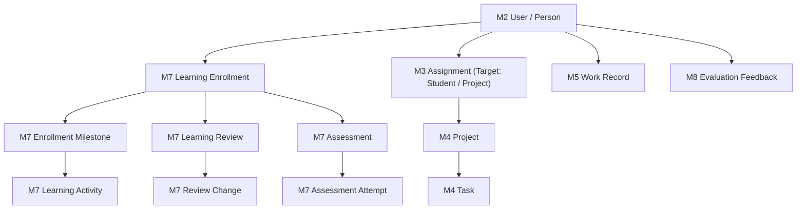

# DeVoc OS — F2 Student Experience Architecture

## 1. Executive Summary

Milestone **F2 — Student Experience** delivers a production-grade personalized learning operating system for DeVoc learners on top of the established F1.2 frontend foundation. Grounded directly in the backend **M7 Learning Engine** and integrated with **M2 People**, **M3 Assignments**, **M4 Projects & Tasks**, **M5 Work**, and **M8 Evaluations**, the student interface functions as the **Experience Layer**. The backend remains the sole authoritative source of truth; no business logic or state machines are duplicated in the frontend.

The student experience directly answers the six core pedagogical questions:
1. **Where am I in my learning journey?** Current program, current milestone, and sequential curriculum roadmap.
2. **What should I do next?** Primary actionable next activity and pending assessment deadlines.
3. **Why am I learning it?** Clear purpose, learning objectives, and practical delivery requirements.
4. **What feedback have I received?** Mentor review evaluations, qualitative guidance, and roadmap adjustments.
5. **Who is mentoring me?** Assigned technical mentor, scheduled sync cadence, and mentorship history.
6. **How am I progressing?** Personal learning progress, milestone completion rates, verified assessment mastery, and shipped project contributions.

---

## 2. Route Architecture

All student routes are served by the Next.js App Router under `/learning` and `/dashboard` (when active role is `student`):

| Route Path | View Component | Domain Backend Engine | Purpose |
| :--- | :--- | :--- | :--- |
| `/dashboard` *(role: student)* | `StudentHomeView` | M7, M3, M4, M8 | Daily student home answering where am I, what to do next, attention items, and progress. |
| `/learning` | `StudentLearningView` | M7 Learning | Overview of active vs. historical enrollments, program progress, and mentor assignment. |
| `/learning/roadmap` | `StudentRoadmapView` | M7 Learning | Personalized learning roadmap displaying milestone sequence, progress, and nested activities. |
| `/learning/activities` | `StudentActivitiesView` | M7 Learning | Scannable, filterable list of curriculum reading, practice, project, and assessment activities. |
| `/learning/activities/[activityId]` | `StudentActivityDetailView` | M7, M4, M8 | Deep dive into an activity: objectives, instructions, resources, evidence submission, and feedback. |
| `/learning/assessments` | `StudentAssessmentsView` | M7 Learning | Authoritative knowledge checks, attempt submissions, scoring, and certification records. |
| `/learning/mentor` | `StudentMentorView` | M3, M2, M7 | Dedicated mentor profile, review sync cadence, capacity, and historical mentorship evaluations. |
| `/learning/reviews` | `StudentReviewsView` | M7 Learning | Student review history timeline with qualitative notes and progress values. |
| `/learning/reviews/[reviewId]` | `ReviewDetailPage` | M7 Learning | Detailed review evaluation displaying reviewer notes and recorded roadmap changes. |
| `/learning/feedback` | `StudentFeedbackView` | M7, M8 | Actionable suggestions board categorized by status (Open, In Progress, Completed). |
| `/learning/projects` | `StudentProjectsView` | M3, M4, M5 | Real engineering projects assigned to the student with task deliverables and work contributions. |
| `/learning/projects/[projectId]` | `StudentProjectDetailPage` | M4, M5 | Project detail showing tasks, student role context, and logged work contributions. |
| `/learning/progress` | `StudentProgressView` | M7, M11 | Authoritative personal learning metrics, milestone velocity, and activity type distribution. |
| `/learning/achievements` | `StudentAchievementsView` | M7, M4 | Verified academic outcomes and completed milestone deliverables without childish gamification. |
| `/profile` | `ProfilePage` | M2, M7 | User identity, active tenant membership, assigned roles, and Academy enrollment details. |

---

## 3. Domain Model Mapping & Integration

The frontend orchestrates authoritative backend domain models:

### 3.1 Learning Journey & Personalization (M7)
- **Enrollment Separation**: Active enrollments are strictly distinguished from historical enrollments (`completed`, `paused`, `withdrawn`). Historical progress is never mixed with active progress.
- **Personalized Roadmap**: The UI renders `EnrollmentMilestone` and `LearningActivity` instances generated for the student upon enrollment. Template programs (`LearningProgram`, `MilestoneDef`, `ActivityDef`) serve as archetypes, but the student's personalized journey is authoritative.
- **State Progression**: Activity completion (`POST /learning-activities/:id/complete`) and skip (`POST /learning-activities/:id/skip`) invoke authoritative backend state transitions.

### 3.2 Mentorship & Reviews (M3, M7, M2)
- **Mentor Relationship**: Mentors are assigned via generic M3 assignments (`targetType='student'`, `targetId=personId`, `roleContext='Mentor'`). No separate "mentor" table is invented.
- **Review History**: All mentor evaluation sessions are append-only records in `learning_reviews`.
- **Review Changes**: Explicit roadmap alterations approved during reviews are persisted in `learning_review_changes` and queried via `GET /learning-enrollments/:enrollmentId/reviews/:reviewId/changes`.

### 3.3 Structured Suggestions & Feedback (M7, M8)
- Actionable suggestions are extracted from review feedback and M8 evaluation rubrics.
- Supported statuses: `open`, `in_progress`, `completed`, `accepted`, `deferred`, `superseded`.

### 3.4 Projects, Tasks, and Work (M3, M4, M5)
- Student projects integrate directly with M4 Projects via M3 Assignments (`personId=studentPersonId`, `targetType='project'`).
- Students track deliverables through M4 Tasks and submit proof-of-work contributions through M5 Work Records (`POST /work`).

---

## 4. State Management & API Architecture

- **Data Fetching & Cache**: Server state is managed exclusively via TanStack React Query (`@tanstack/react-query`). No server state is mirrored into client-side stores like Zustand.
- **Query Keys**: Structured hierarchical keys:
  - `['student', 'enrollments', orgId, userId]`
  - `['student', 'milestones', orgId, enrollmentId]`
  - `['student', 'activities', orgId, enrollmentId]`
  - `['student', 'reviews', orgId, enrollmentId]`
  - `['student', 'assessments', orgId, enrollmentId]`
  - `['student', 'attempts', orgId, assessments]`
  - `['student', 'mentor-assignment', orgId, userId]`
  - `['student', 'projects', orgId, assignments]`
- **Cache Invalidation**: Mutations immediately invalidate dependent query keys, ensuring data integrity without optimistic guessing.

---

## 5. Visual Design & Anti-AI-Slop Architecture

The student experience strictly adheres to the DeVoc Design System:
- **Typography**: Clean, restrained Inter typography with strict hierarchy.
- **Surfaces & Borders**: Neutral surfaces (`bg-devoc-card`, `bg-devoc-bg`), 1px restrained borders (`border-devoc-border`), and 4–12px radii.
- **Anti-AI-Slop Principle**: No cartoon visuals, excessive gradients, glassmorphism, floating emoji, arbitrary XP points, fake badges, or leaderboards. Achievements represent genuine, verified milestones backed by audit records.
- **Mobile-First Responsiveness**: Designed intentionally for breakpoints 320px, 375px, 768px, 1024px, and 1440px+.

---

## 6. Accessibility (WCAG 2.2 AA)

- **Accessible Colors & Contrast**: Status is never represented by color alone; every badge and progress indicator pairs an icon, a text label, and an accessible contrast token.
- **Keyboard Navigation**: Full keyboard tab sequence support, visible focus rings (`focus-visible:ring-2 focus-visible:ring-devoc-brand-ring`), and accessible dialog focus traps.
- **Screen Reader Support**: Semantic HTML5 elements (`main`, `nav`, `section`, `h1`–`h4`), ARIA dialog roles (`role="dialog"`), and descriptive button labels.
